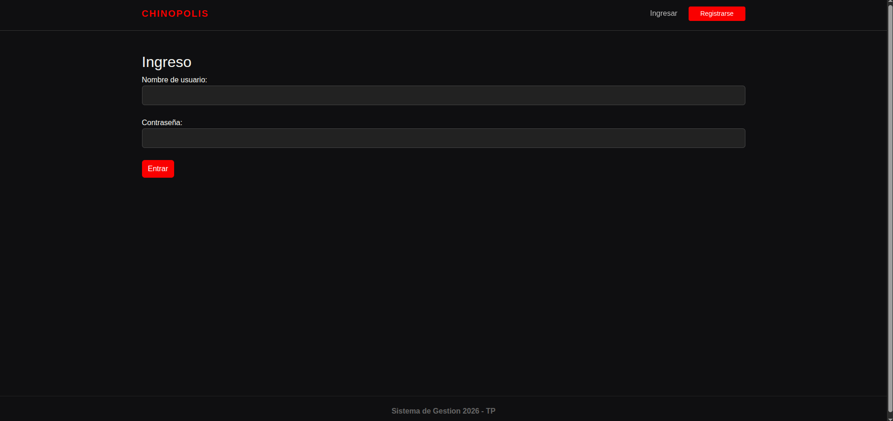
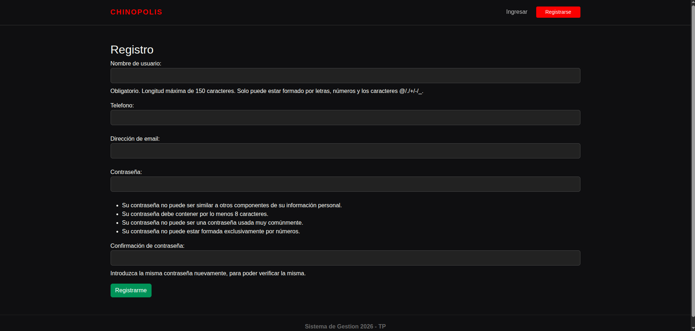
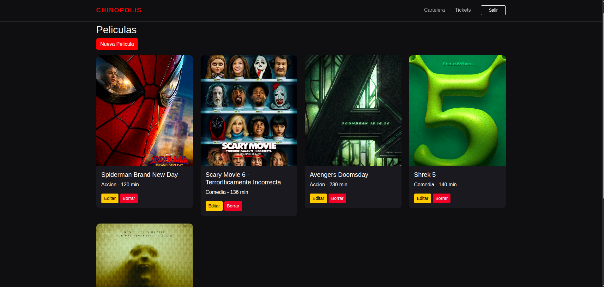
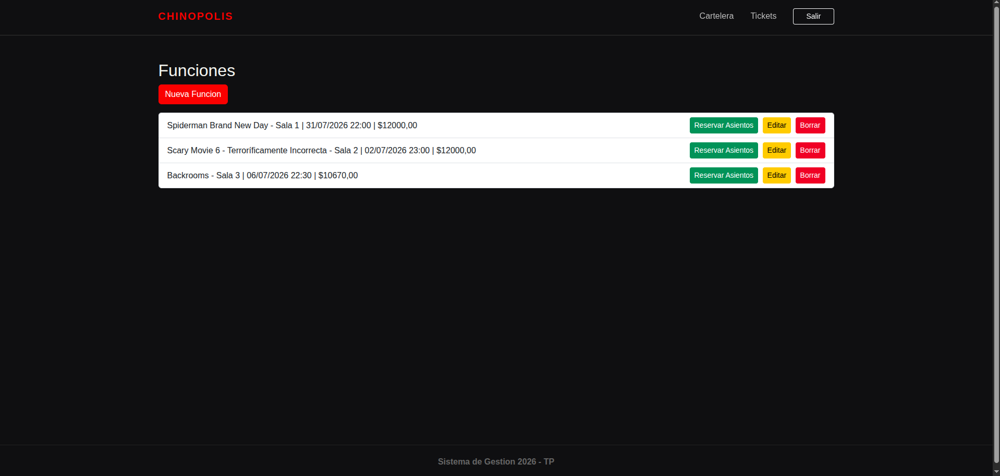
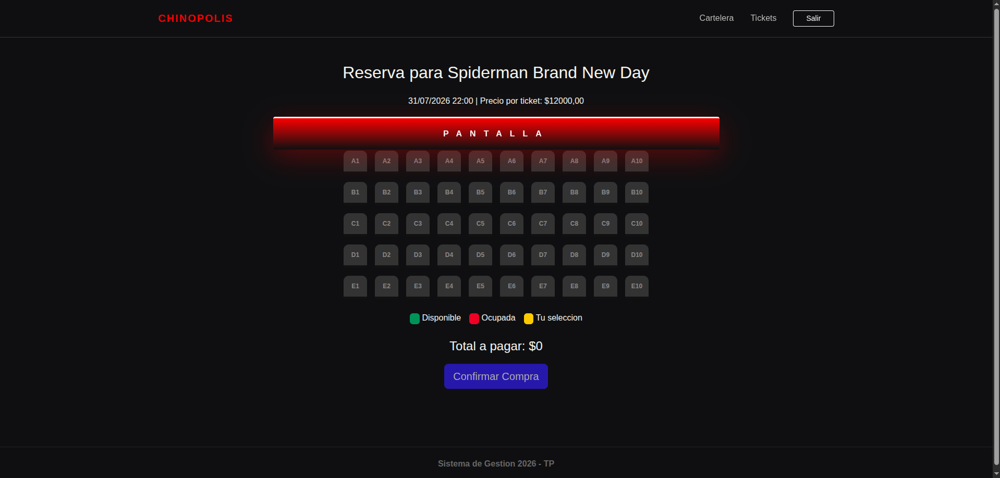
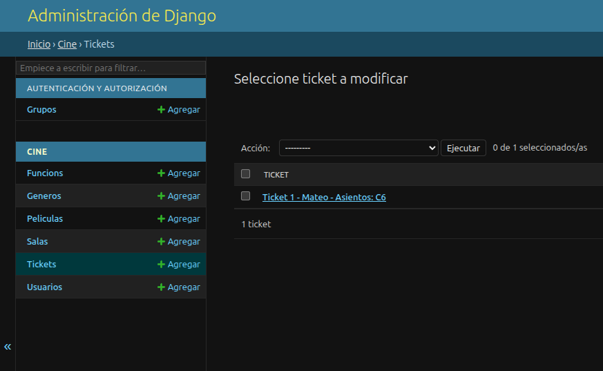

# Chinópolis - Sistema de Gestión de Cine

¡Bienvenido a **Chinópolis**! Un sistema web desarrollado con **Django** que permite administrar la cartelera de un cine, gestionar funciones y realizar la reserva de asientos de manera sencilla e intuitiva.

La aplicación maneja los siguientes aspectos:

* **Sistema de Usuarios:** Los usuarios pueden registrarse, iniciar sesión y acceder a las funcionalidades del sistema.
* **Cartelera de Películas:** Se puede visualizar el catálogo de películas disponibles con su imagen, género y duración.
* **Gestión de Funciones:** Permite crear, editar y eliminar funciones indicando la sala, fecha, horario y precio de cada entrada.
* **Reserva de Asientos:** Los usuarios pueden seleccionar los asientos disponibles para una función y confirmar la compra de sus tickets.
* **Administración Completa:** Mediante el panel de administración de Django es posible administrar películas, géneros, salas, funciones, tickets y usuarios.

---

## Base de datos

La base de datos relaciona las siguientes entidades:

* **Películas**, que contienen la información principal de la cartelera.
* **Géneros**, asociados a cada película.
* **Salas**, donde se proyectan las funciones.
* **Funciones**, que vinculan una película con una sala, fecha, horario y precio.
* **Tickets**, que almacenan la reserva de uno o varios asientos realizada por un usuario.
* **Usuarios**, quienes pueden registrarse, iniciar sesión y reservar entradas.

---

# Cómo ejecutar el proyecto

1. **Clona o descarga** este repositorio.

2. Abre una terminal dentro de la carpeta del proyecto.

3. Crea y activa un entorno virtual (opcional, pero recomendado).

4. Instala las dependencias del proyecto.

```bash
pip install django pillow
```

```bash
pip install -r requirements.txt
```

5. Aplica las migraciones de la base de datos.

```bash
python manage.py makemigrations
```

```bash
python manage.py migrate
```

6. Ejecuta el servidor.

```bash
python manage.py runserver
```

7. Abre tu navegador e ingresa a:

```
http://127.0.0.1:8000/
```

Para acceder al panel de administración crea un superusuario:

```bash
python manage.py createsuperuser
```

Luego accede desde:

```
http://127.0.0.1:8000/admin/
```

━━━━━━━━━━━━━━━━━━━━━━━━━━━━━━━━━━━━━━━━━━━━━━━━━

# Capturas de pantalla

## Login



━━━━━━━━━━━━━━━━━━━━━━━━━━━━━━━━━━━━━━━━━━━━━━━━━

## Registro



━━━━━━━━━━━━━━━━━━━━━━━━━━━━━━━━━━━━━━━━━━━━━━━━━

## Cartelera



━━━━━━━━━━━━━━━━━━━━━━━━━━━━━━━━━━━━━━━━━━━━━━━━━

## Gestión de Funciones



━━━━━━━━━━━━━━━━━━━━━━━━━━━━━━━━━━━━━━━━━━━━━━━━━

## Reserva de Asientos



━━━━━━━━━━━━━━━━━━━━━━━━━━━━━━━━━━━━━━━━━━━━━━━━━

## Tickets (Panel de Administración)



━━━━━━━━━━━━━━━━━━━━━━━━━━━━━━━━━━━━━━━━━━━━━━━━━